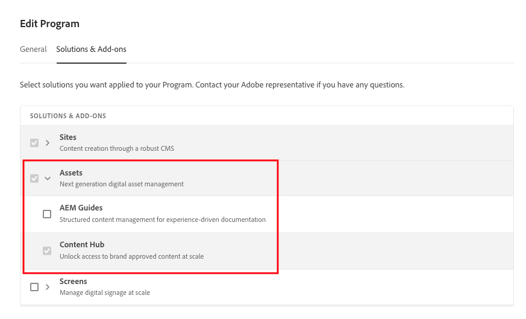
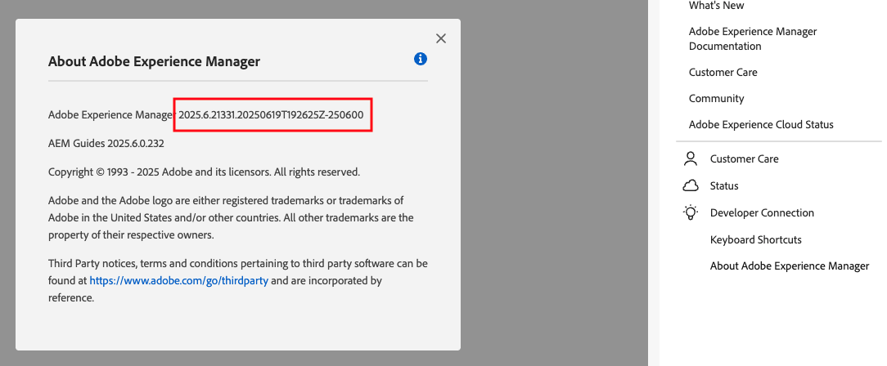
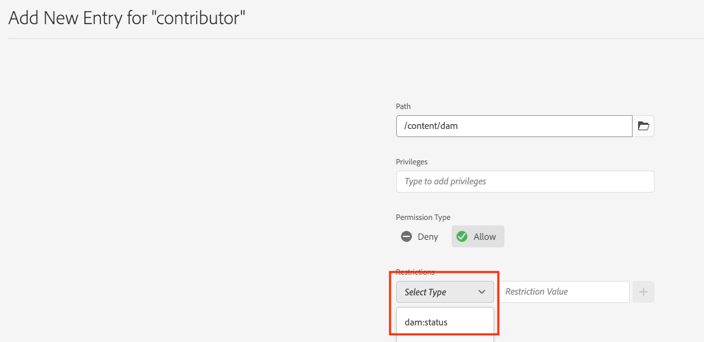
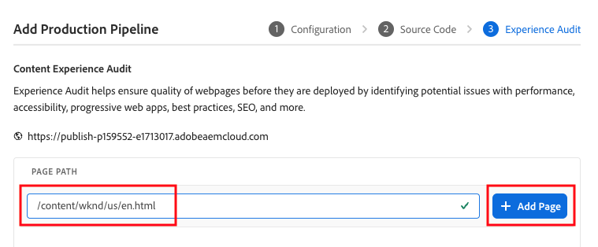
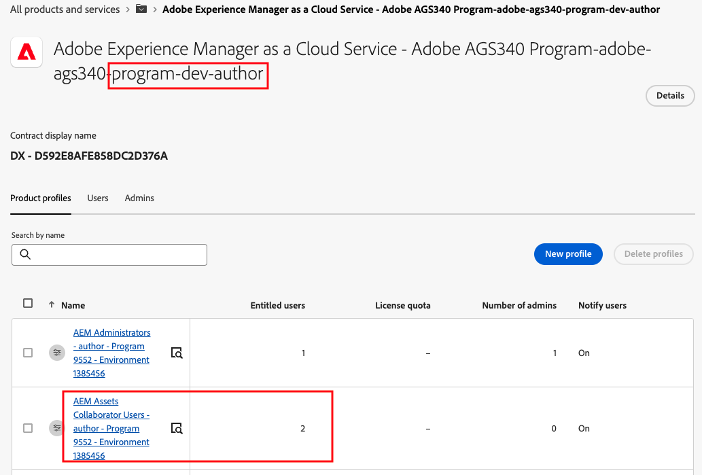

# ADLS Training: Assets Power User Update - Assets View

Duration: 3 hours

Version: AEM as a Cloud Service

### Course Release Log

| Version | Date       | AEMaaCS Release Version | Comments                                                               |
|---------|------------|-------------------------|------------------------------------------------------------------------|
| 1       | 15/07/2025 | 2025.7                  | First draft                                                            |
| 2       | 20/08/2025 | 2025.7                  | Presentation improved and updated.  Script separated from presentation |
| 3       | 24/09/2025 | 2025.9                  | New content in presentation, extended metadata exercise                |
| 4       | 18/10/2025 | 2025.10                 | Add contextual search exercise.  Add future parity/strategy slide      |

## Course Objective

Empower current AEM Assets teams to successfully adopt the new Assets View UI in AEM as a Cloud Service.

---

## Who Should Attend

This course is tailored for:

- Product Owners
- Business and Technical Architects
- Senior Developers
- Assets Administrators and Power Users

---

## Assumed Knowledge

This is an advanced level course. Participants should have a solid understanding of AEM Assets, including key concepts such as metadata and permissions. The course will quickly move beyond basic functionalities (like file upload), focusing instead on the critical differences between _Assets View_ and the standard AEM _Admin View_ (Touch UI).

Less experienced Assets users should consider completing the ADLS course _Customize Digital Assets in AEM_ before attending _Assets Power User Update_.

---

## Prerequisites

_None._

---

## Learning Outcomes

By the end of this course, you will be able to:

- Access the Assets View from the Experience Cloud console
- Use standard DAM functionality in Assets View
- Understand the interaction between Assets View and Admin View
- Understand the use cases for Assets View and Admin View
- Understand and configure metadata in Assets View and understand how this differs from Admin View
- Understand and configure Metadata-Driven Permissions 
- Understand and configure folder access control in both Assets View and Admin View
- Recognize the increased complexity and need for effective governance with the new features
- Understand the configuration and customization possibilities of Assets View
- Understand the capabilties of Assets View Insights

---

## Course Topics

- **Assets View Overview**
  - Role and interaction with Admin View
  - Future parity / strategy 
  - Uploading and editing assets
  - Accessing renditions and versions
  - Search

- **Metadata Handling**
  - Forms vs Schemas
  - Metadata configuration and migration

- **Access Control**
  - Metadata-Driven Permissions 
  - Folder-level access across both UIs

- **Customization & Governance**
  - Assets View UI extensibility overview
  - Governance implications of dual ACLs

- **Insights**
  - Exploring Assets View Insights features

---

## Course Materials

The course consists of:

- Workbook consisting of student activities and one instructor demo

- PPT presentation

- Full speaker script

- One image file in Exercise_Files folder

- This document ☺

- OSGi configuration file for Metadata Driven Permissions activity.

- feature_comparison.MD in the instructor folder. This is a best effort to record the key capabilities and gaps and intended to support instructors stay up to date on the topic. Not for distribution and may contain errors.

## Preparation

This is a technical course that should be delivered **without**
automated instance creation on a single, shared AEMaaCS production
instance. Familiarity with Cloudmanager and some minor development
knowledge is therefore needed for the preparation.

Git and a text editor or IDE are needed to prepare the training
instance.

**Product Changes**

The course is vulnerable to product changes. Therefore, check the AEM
release version in the document control area, and check release notes
for changes since then. The slide **Schemas vs Forms: Key Differences**
is particularly at risk, and it is likely that the UI will be different
than the screenshots in the activity workbook.

**Training Environment Setup**

MPaaS cannot be used for this course.  Complete a manual setup as follows:

1.  Create/use an AEMaaCS Program including **Stage/Prod** environments
    (a dev environment may not sufficient for some parts of the hands-on
    exercises, as an *Assets Ultimate* license can only be associated
    with prod). If a new program, check the Solutions and Add-Ons to
    ensure that Assets and Content Hub are enabled.
    
   

3.  **check that any existing instances are on the latest release
    version**. New assets features are regularly released, and the
    Assets View UI may not work correctly if the instances are out of
    date.

4.  Clone the Cloudmanager repo of your AEM program on to your local
    system.

5.  Clone v4 of WKND: <https://github.com/adobe/aem-guides-wknd> on to
    local system.

6.  Copy all files **except the .git folder** from your cloned
    *aem-guides-wknd* folder into your local cloudmanager repo (step 2
    above).

7.  Comment out the ui.tests and it.tests modules in the project (top
    level) pom.xml, and delete the ui.tests and it.tests folders. This
    will reduce the risk of pipeline failures.

8.  Update the project (top level) pom.xml to use the correct AEMaaCS
    version (found in _help->about_ in an AEMaaCS instance)
   
   

    <aem.sdk.api>2025.7.21484.20250703T155820Z-250600</aem.sdk.api>

8.  Copy the json config file in the course *instructor* folder in the
    to the folder
    _ui.config/src/main/content/jcr_root/apps/wknd/osgiconfig/config.author_

9.  Add, Commit and Push all changes to your Cloudmanager repo.

10. Add (if necessary) and run the non-production pipeline and check
    that it completes successfully.

11. Navigate to _/ui#/aem/security/permissions.html_ on the dev author and
    start to configure a new ACE entry for any path and group. Check
    that the *dam:status* restriction in available in the type dropdown
    (from the OSGI config above). Don't save.
    
   

13. Add (if necessary) and run the production deployment pipeline (if a
    new pipeline you may want to set the failure behaviour to *Continue
    Immediately*, and you should enter */content/wknd/us/en.html* as the
    test page for the Content Experience Audit).
    
   

14. Add the test user group as normal (prod instance only) and assign
    them to the prod author **administrators**.

15. Create a single sample user (can be one of the VLab users that you
    just added by group) and change the permissions to **only** **DAM
    contributors** group in the Experience Cloud admin console. This
    user will be used only to show the permissions system in an
    instructor demo and should not be assigned to a student.
    
   

16. Create a folder *WKND Shared \> English \> **Training Assets**.*

17. Upload the Exercise_Files/test.pdf file into Training Assets (students will view the metadata for this in one of the exercises).

18. Configure **Dynamic Media** as described in the standard assets
     courses. 
19. Create a Grayscale rendition (Image Preset).

20. Create a Smartcrop profile and apply it to the _Training Assets_ folder.

## Create Exercise Guide

To build a new exercise guide, set up the Docker instance and node tooling by following:

https://git.corp.adobe.com/ADLS/styleguide

A new version of the Exercise guide can then be created by running the following command in the project root directory.  The new guide will be written to the _merged_ directory.

```
merge-markdown -m manifest.yml --pdf --docker
```
