# Module [#]: Introduction to Assets View and Metadata

#### Introduction

In this module, you will learn the basic usage of the Assets View interface by uploading and editing an image, then focus on metadata management.

#### Module Navigation

<!-- START do not remove -->
<!-- START doctoc -->
<!-- END doctoc -->
<!--{returnToMainTOC}-->
<!-- END do not remove -->

## Activity [#]-1: Upload and Edit in Assets View

### Create a folder and upload an image

1. Open *Experience Manager Assets* from the chocolate bar menu.

2. Navigate to *Asset Management \> Assets \> WKND Shared \> English \> Training Assets* and use the **Create Folder** button to create a folder using your first name and an initial, if necessary, e.g., Rob*F*.

   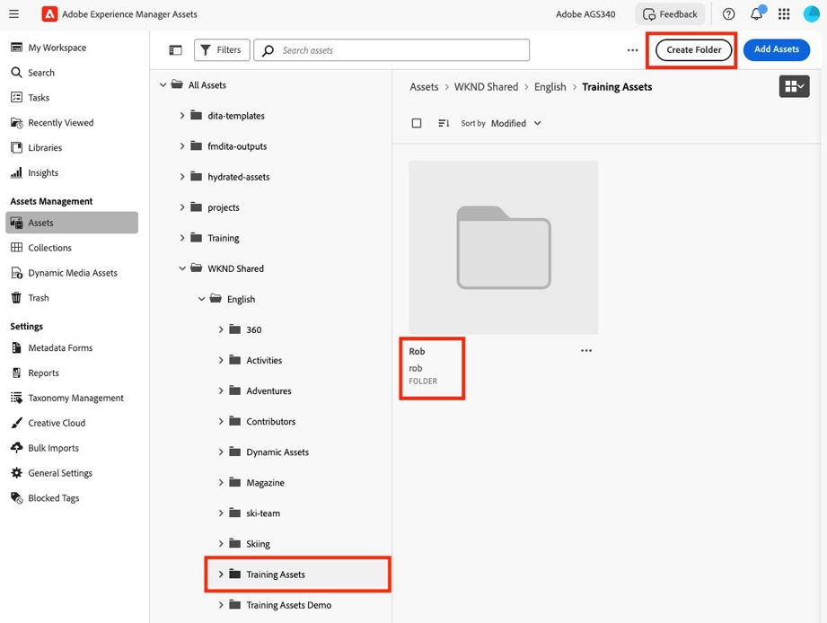

3. **Drag and drop** the exercise image from the *Exercise_Files* folder on to your newly created folder. The _Upload Files_ modal dialog appears.

4. Leave the checkbox *Publish to AEM and Dynamic Media* **unchecked** and click ***Upload*** (the image that has been created with a large amount of meta-data specifically for testing – feel free to keep a copy for your own tests!).

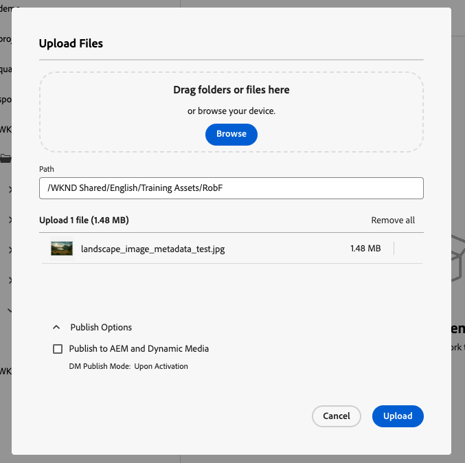

5. A green bar and success message is shown if the upload was successful, and a placeholder image should be shown shortly afterwards with a ***Processing*** label. The asset is being processed by AEM as a Cloud Service *Asset Microservices*. **Be patient** - this process can take more than a minute to complete.

    The UI will then automatically update and the label will change to ***new***.

6. Click the **ellipsis** (three dots) below the thumbnail of the image you just uploaded.

   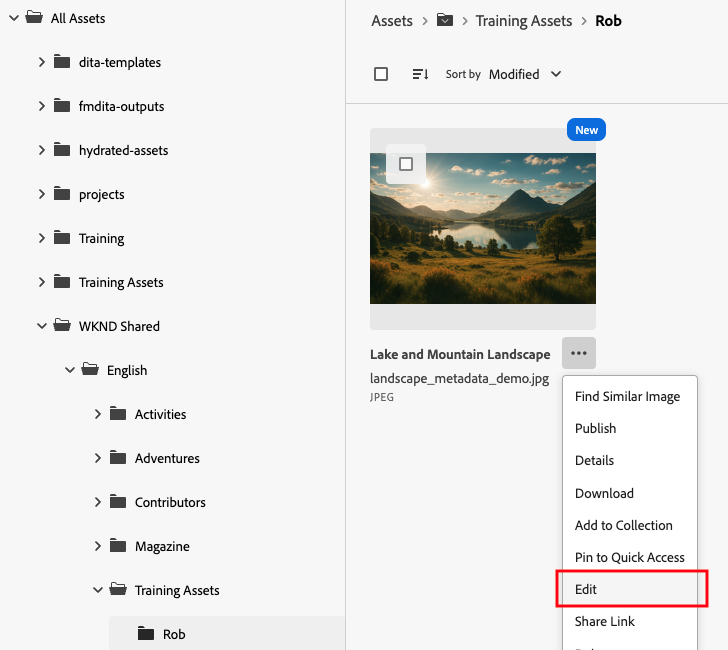

7. Choose Edit. A limited version of **Adobe Express** will open. **Make any change** such as cropping your image.

8. Click **Save** As, then **Version**.

   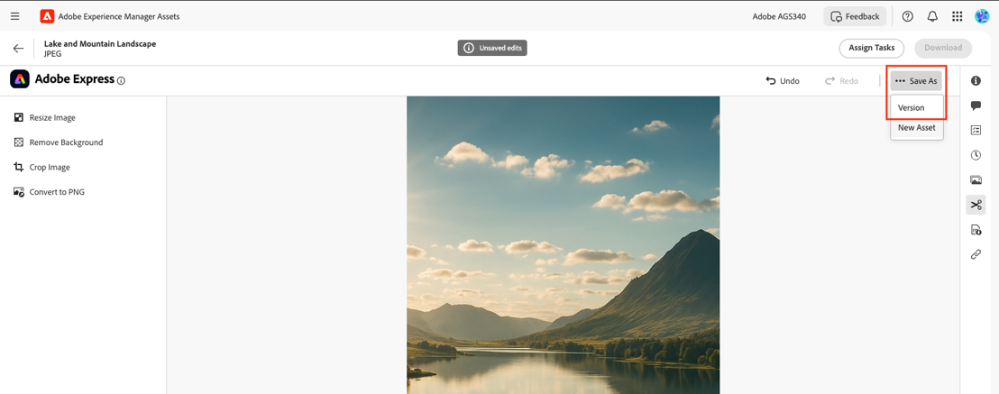

9. Image processing starts, as happened when you first uploaded the image. Click the **back arrow** to the folder.

   

10. While the image is processing, take some time to look at others parts of the UI, such as the configurable _My Workspace_ (new in Assets View) and tagging (essentially the same as the Admin UI, except no management features).

### Use the Version Viewer

1. Once processing has completed, **double-click on the asset** to open it and click the 'Versions' (clock) icon in the right toolbar.

   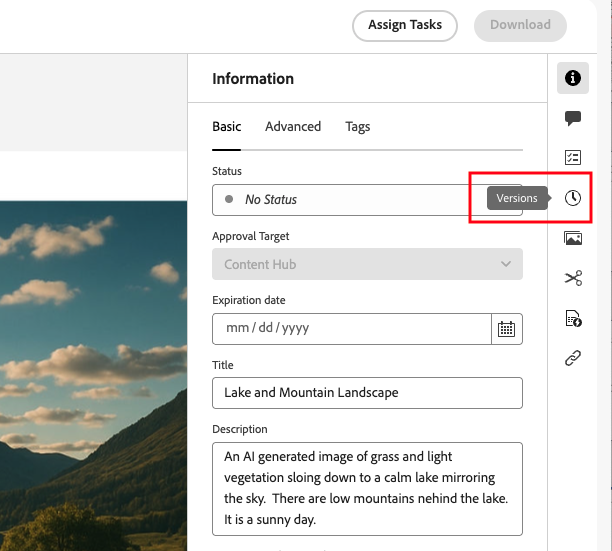

2. Select a previous version (the original).  The image area nows shows the side-by-side comparison tool.  Use this to inspect the changes made in Adobe Express.

3. Click **Make Latest** to restore the original version.

## Activity [#]-2: Access Renditions

### Explore Smart Crops and Renditions

> The training environment has Dynamic Media features. Dynamic Media is a separate licensed product that adds advanced asset handling features to Experience Manager.  
> As a result Dynamic Renditions and [Smart Crops](https://experienceleague.adobe.com/en/docs/experience-manager-learn/assets/dynamic-media/images/smart-crop-feature-video-use) are available.  See 

1. In the right hand menu (details area) you will find a list of Dynamic Renditions and Smart Crops. You can download a static version of the asset or, if the image is published, copy the URL using buttons below the renditions.

2. Use the **Switch View** link to change to the same image in the **Admin View**.  

      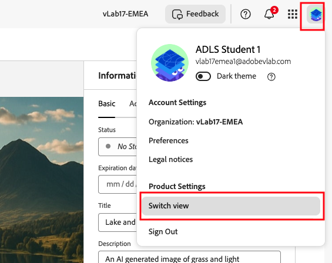

3. In the Admin View select **Renditions** from the left rail menu.

      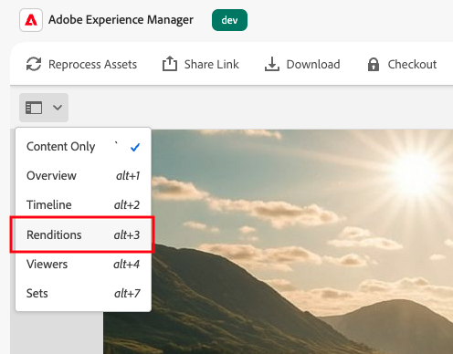

The same are shown, including Dynamic Renditions and Smart Crops.  The renditions are being delivered from the Dynamic Media preview server.

4. Use the **Switch View** link to change back to the same image in the **Assets View**.

5. Click the back arrow, to the left of the image title to return to your folder.

      

## Activity [#]-3: Publish the Image

1. Open the test image by double clicking on it.

2. Use the **Switch View** link to change to the same image in the **Admin View** ('traditional' Experience Manager).

      

3. Once the image is open in the Admin View, copy the URL from the address bar.  This should be similar to below but thout the spaces between URL segments.

   ```
   https://author-p123456-e123456.adobeaemcloud.com  /ui#/aem/assets.html  /content/dam/wknd-shared/en/Training%20Assets/yourfolder/landscape_image_metadata_test.jpg  ?appId=aemshell
   ```
4. Construct the URL for the image on the Experience Manager publish server by replacing the word **author** with **publish**, and removing the the elements _/ui#/aem/assets.html_ (this is the editing interface) and _?appId=aemshell_, giving you a URL like this:

   ```
   https://publish-p123456-e123456.adobeaemcloud.com/content/dam/wknd-shared/en/Training%20Assets/yourfolder/landscape_image_metadata_test.jpg
   ```
5. In a new tab or window navigate to the new URL in your browser address bar (new tab or window) and you should get a **Not Found** error.  This is because the image has not been published (if you do see the image at this point, you may have published it by mistake when uploading).

6. In the Experience Manager editor use the **switch view** to move from Admin View back to Assets View.

7. Navigate to the containing folder (_Training Assets_, select the image and click **publish** in the blue actions bar.

   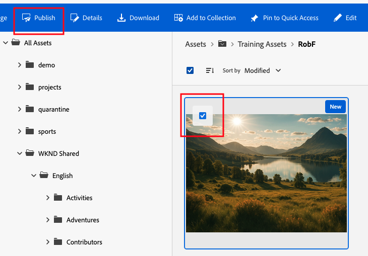

8. Select the _AEM_ checkbox in the modal dialog and **publish**.  A green notification panel will confirm that the image was published.

   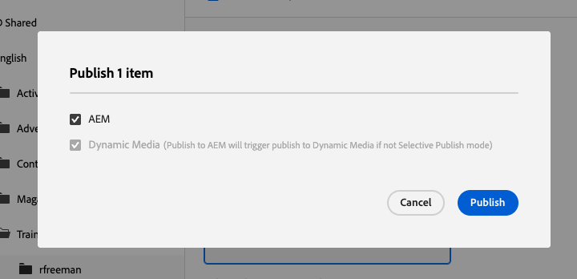

9. Once again enter the publish instance URL for the image in a new tab (the URL is **similar** to below).  This time there will be no _Not Found_ error and the published image will either open, or download.

   ```
   https://publish-p123456-e123456.adobeaemcloud.com/content/dam/wknd-shared/en/Training%20Assets/yourfolder/landscape_image_metadata_test.jpg
   ```

10. Open the details panel of the test image and scroll to the bottom of the panel.  Note that the publish state and publishing time of the asset is shown.

    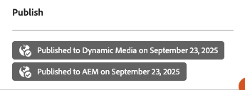

      > The publish mechanism creates a copy of the asset on the Experience Manager publish server, and optionally 
      > to the Dynamic Media delivery server.  
      > Until the release of the latest generation of AEM Assets tools (ca. 2024), this was the standard way to make images
      > available for use by asset consumers, or for use in Experience Manager (Sites) web pages.
      > 
      > We do not **approve** images in this exercise as we are not using one of the new delivery channels (Content Hub or the Dynamic Media API).
      > Approval is a metadata field that only becomes relevant when using these systems.

### Delete and Restore the image

1. Navigate to your folder and use the ellipsis menu to delete your test image, clicking first on the **delete** button in the menu, then again on the delete button in the modal confirmation layer.  The image is removed from the UI.

      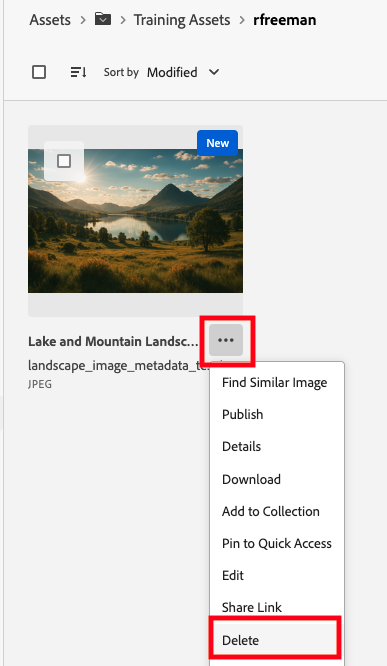

   > In the Admin View (Touch UI) this is a final operation.  Without the restoration of a backup this cannot be undone.
   > Assets View is different and has a Trash folder. Images deleted using Assets View can be restored. 

2. As only asset and folder titles are visible in the Trash tile view, it can be difficult to find an image if there are others, as is likely the case if your fellow students hsve also deleted their test images.  To overcome this, change to the **list view** as shown below:

      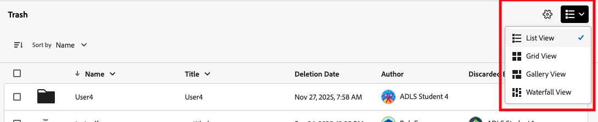

3. Locate your deleted image, click the ellipsis and then **restore**.

    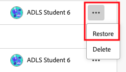

4. Check your folder to be sure that the image was restored.


