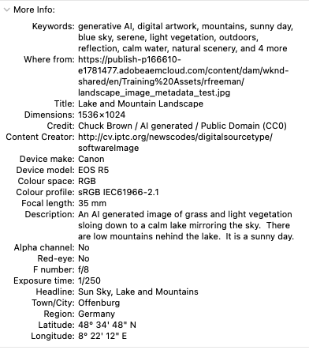
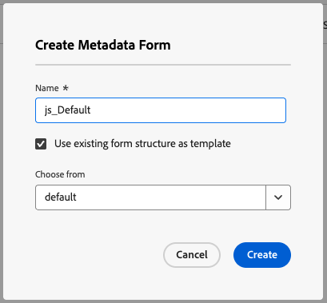
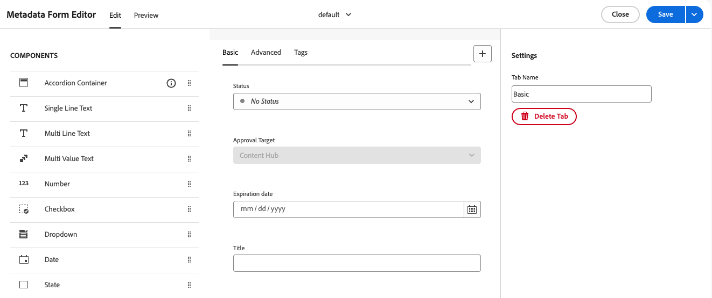
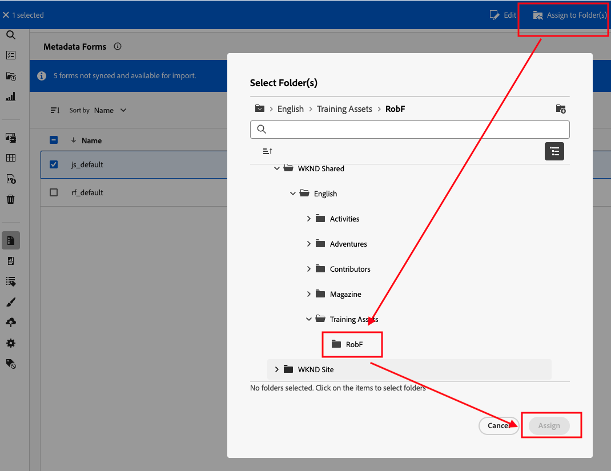
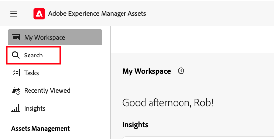
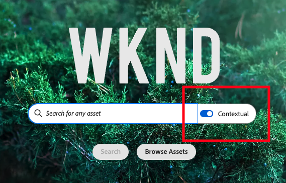

# Module [#]: Metadata and Search

#### Introduction

In this module, you will:
- learn how asset metadata is accessed in the user interface
- learn how to configure the available metadata fields
- use the search mechanism
- understand search mechanism configuration

#### Module Navigation

<!-- START do not remove -->
<!-- START doctoc -->
<!-- END doctoc -->
<!--{returnToMainTOC}-->
<!-- END do not remove -->

## Activity [#]-1:  View Metadata

1. In the Assets View UI click the information icon in the details panel, inspect the **metadata** in the *Basic* and *Advanced* tabs.  The fields are the defaults provided by Adobe.

2. The image does actually have much more metadata that you do not currently see.  You can see this by downloading the image and inspecting it on your computer.
   - In MacOS right-click on the image and click on **Get info** (result as in the screenshot below)
   - In Windows 11, right-click, then choose **Properties**, then **Details**.

      

   > The reason you only see part of the metadata is because Adobe, and the system administrator, have applied **Metadata Forms**, so defining which metadata fields are visible and editable in the Assets View user interface (these Metadata Forms are the equivalent of Metadata Schemas in Admin View).
   > By changing the Metadata Forms applied to folders and MIME types, difference metadata can be shown and edited, as required for the asset management in your company.

## Activity [#]-2: Understand Metadata Forms

1. From the left menu, select **Settings** > **Metadata Forms**. You may see an empty page if only the default configurations are used as these defaults are invisible in the UI. You can see the defaults by either:

    - View the metadata in the details of an asset as we did in the previous
      exercise.

    - Create a new form using an existing form structure as the template.  Although this is **normally a power user or administrator responsibility**, we'll do that now:

2. In the Metadata Forms panel, click **Create**, then enter *\<your initials\>_default* in the Name field of **Create Metadata Form** panel, eg., _js_default_.

     

   (if you were to name the new form _default_ you would override the standard default form - **DON'T do that** in this exercise. The default is applied to any assets that do not have forms specific to their MIME types).

3. Select the **checkbox** *use existing form structure as template* and the select *default* in the **Choose from** field. Click **Create**.

4. The Metadata Form Editor is loaded. The fields shown are copied from the standard *default* form.

     

5. Select and delete the status field of the form.  This may suit a traditional folder-based permissions use case in which the status is not used.

6. Click **Save**, wait for a success message, then **Close** to exit the form editor.

7. As your form is named neither *default* nor a MIME type, it will not be used anywhere yet.

8. Now assign your form to your folder in Training Assets by clicking **Assign to Folders** in the blue header bar, then selecting **your folder** and clicking **Assign**.

   

9. Open your training asset detail. Your modified metadata form has been applied and your users will no longer be able to set or see the asset status.

10. Return to your folder and upload in to your folder the **test.pdf** file in your Exercise_Files.

11. After the asset has been processed open the details view and note that your metadata form is being used, not the MIME-type specific form that is normally used for a PDF (to see the standard form, open the same test.pdf that your instructor has uploaded in the Training Assets folder).

## Activity [#]-3: Search

1. Click on the search icon at the top of the left panel.

   

2. Search for _Lake_ to view a selection of results.  Note that you searched the entire DAM.  When the results are shown you can filter by path, but it is a secondary action.

3. Click the back arrow (ideally in Assets View, not the browser back button).

4. If not already enabled, enabled the contextual search functionality using the toggle to the right of the search field.

   

5. Enter _images of a lake uploaded in the last week_

6. You will see fewer images and a _Create Date_ search filter has been automatically added to the header search bar.  This is the result of the natural language search - creation of search filters.

7. Experiment with natural language searches to explore the limits of the contextual search.   

## Activity [#]-3: Search
