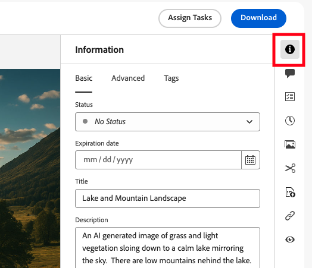
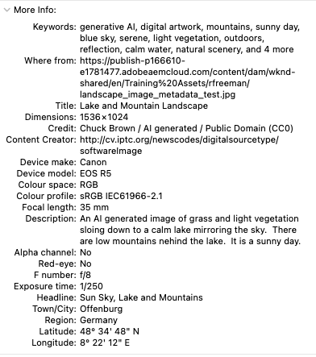
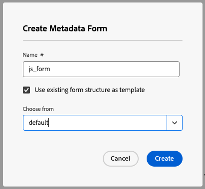
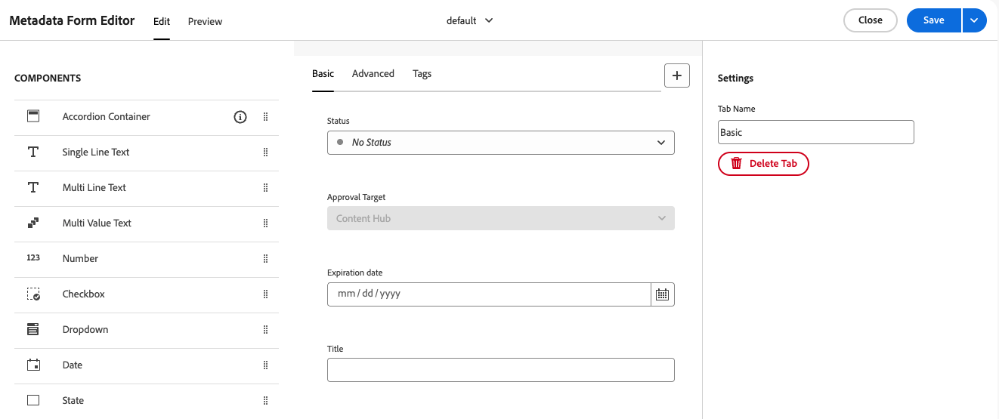
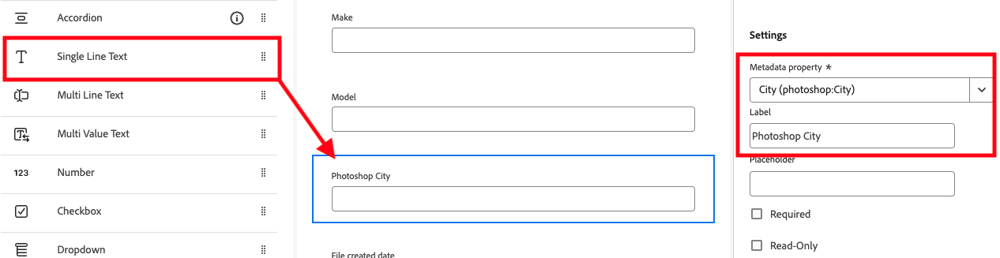
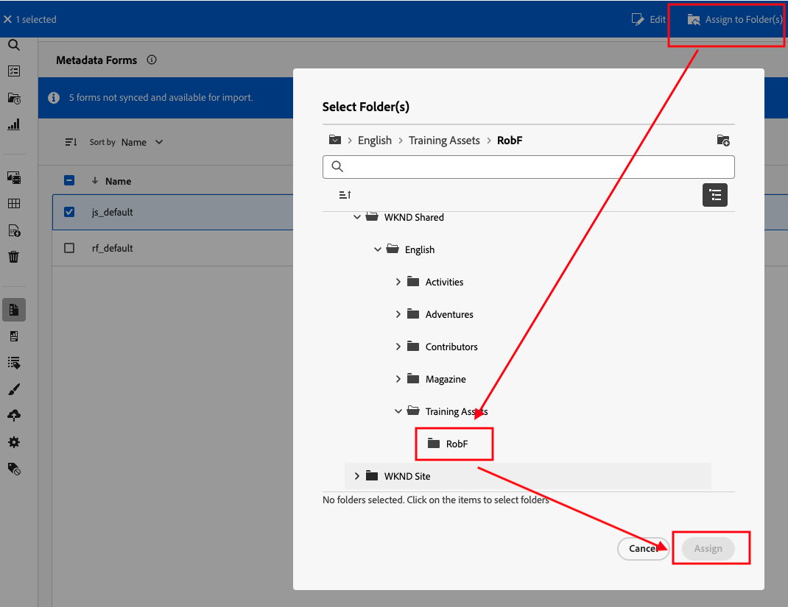
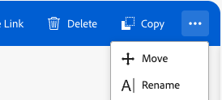
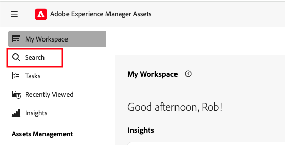
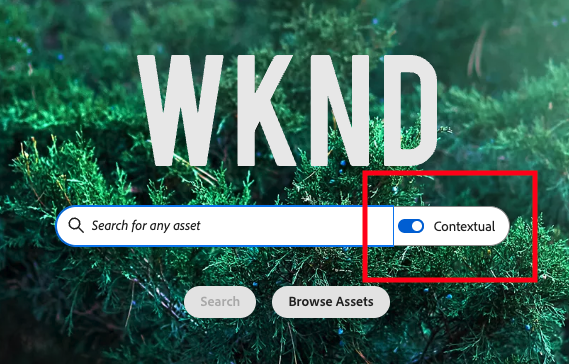

# Module [#]: Metadata and Search

#### Introduction

In this module, you will:
- learn how asset metadata is accessed in the user interface
- learn how to configure the available metadata fields
- use the search mechanism
- understand search mechanism configuration

#### Module Navigation

<!-- START do not remove -->
<!-- START doctoc -->
<!-- END doctoc -->
<!--{returnToMainTOC}-->
<!-- END do not remove -->

### Activity [#]-1:  Access Metadata

1. In the Assets View UI, open your test image details and view the information panel.Inspect the **metadata** in the *Basic* and *Advanced* tabs.  The metadata fields you see are the defaults provided by Adobe, and reveal commonly used information such as the image description.

      

2. The image has much more metadata that you do not currently see. You can see **some** of this 'hidden' metadata by inspecting the _landscape_image_metadata_test.jpg_ image in the **activity-files** shared by your instructor.  Do the following:
   - In MacOS right-click on the image and click on **Get info** (result as in the screenshot below)
   - In Windows 11, right-click, then choose **Properties**, then **Details**.
   You will see the following:

      

> The reason you only see part of the metadata is because Adobe, and the system administrator, have applied **Metadata Forms**, so defining which metadata fields are visible and editable in the Assets View user interface (these Metadata Forms are the equivalent of Metadata Schemas in Admin View).

> By changing the Metadata Forms applied to folders and MIME types, different metadata can be shown and edited, as required for the asset management in your company.

### Activity [#]-2: Apply Metadata Forms

1. Leave the image details view, and from Assets View main menu, select **Settings** \> **Metadata Forms**. 

2. In the Metadata Forms panel, click **Create**, then enter *yourinitials_form* in the Name field of **Create Metadata Form** panel, eg., _js_form_.

        

3. Select the **checkbox** *use existing form structure as template* and the select *default* in the **Choose from** field. Click **Create**. The Metadata Form Editor is loaded. The fields shown are copied from the *default* form.

        

4. We will make the metadata property _photoshop:City_ visible and editable in Assets View (photoshop:City is an Adobe metadata field that could conceivably be important for your company, as the location where the image was created or edited, however we are using it merely as an example without a defined use-case!).  Add a single-line text field to the bottom of the form, then configure the form using:

   - Metadata property: City (photoshop:City)
   - Label: Photoshop City

      

5. Click **Save**, wait for a success message, then **Close** to exit the form editor.

6. Now assign your form to your folder in Training Assets by clicking **Assign to Folders** in the blue header bar, then selecting **your folder** and clicking **Assign**.

      

7. Navigate to your folder and open the training image detail view to see the metadata. Your modified metadata form has been applied and the field Photoshop City should now be visible, contain _Offenburg_ and be editable.  

8. Return to your folder and upload in to your folder the **test.pdf** file in your activity files (you do not need to publish this so can leave the _Publish to AEM_ checbox **unchecked** when uploading).

9. After the asset has been processed open the details view and note that your **custom metadata form** is being used, This may not be desirable as a PDF is a different MIME type to an image, and by default has a different, PDF specific, metadata form.  An example issue is that photoshop:City is irrelevant for a PDF.

#### Challenge:  Mixed MIME types and Metadata Forms 

The PDF file you uploaded in the previous exercise has the wrong metadata form applied and you should solve this problem.  

Your PDF and your Image should be able to exist inside your folder or child-folder(s), but with different, MIME-type appropriate, metadata fields.  The PDF should have the default PDF metadata visible, and the image should have your custom metadata visible.

> Hint: Assets does not support the assignment of multiple Metadata Forms to a folder, and assigned forms override any MIME type specific forms.
> Hint: the _Move_ function in the action menu can be used to move assets between folders.  On smaller screens it is folded into the elipsis menu.
      

### Activity [#]-3: Search

1. Click on the search icon at the top of the left panel.

   

2. Search for _Lake_ to view a selection of results.  Note that you searched the entire DAM.  When the results are shown you can filter by path, but it is a secondary action.

3. Click the back arrow (ideally in Assets View, not the browser back button).

4. If not already done, enable the contextual search functionality using the toggle to the right of the search field.

   

5. Enter _images of a lake uploaded in the last week_

6. You will see fewer images and a _Create Date_ search filter has been automatically added to the header search bar.  This is the result of the natural language search - creation of search filters.

7. Experiment with natural language searches to explore the limits of the contextual search.   

   > It is possible to add a custom filter to the search, for example the photoshop:City.  We will not do this as it is a central configuration that we cannot change without conflict on the training system.  In reality it will be managed by an administrator, or power user. You should just remember that configuration of search filters is possible, and straightforward in most cases.

#### The Search Challenge - Where is a result stored?

Search all assets for the term _surfing_.  Choose an interesting image and identify two quick ways to find where that image is stored, i.e. in which folder, without manually browsing through the folder structure, or using _switch view_.

