# Module [#]: Productivity

#### Introduction

In this module, you’ll explore productivity tools available in **Assets View** that make everyday asset management easier — including personalization, notifications, insights, collections, and sharing.

#### Module Navigation

<!-- START do not remove -->
<!-- START doctoc -->
<!-- END doctoc -->
<!--{returnToMainTOC}-->
<!-- END do not remove -->

### Activity [#]-1: My Workspace and Quick Access

The **My Workspace > Quick Assets** panel in Assets View gives you quick access to the assets and folders you use most frequently. You can “pin” items to this view so they are always visible when you sign in.

1. From the left navigation, select **My Workspace** to open your personalized workspace.  Notice the _Quick Access_ panel, which will probably be empty.

      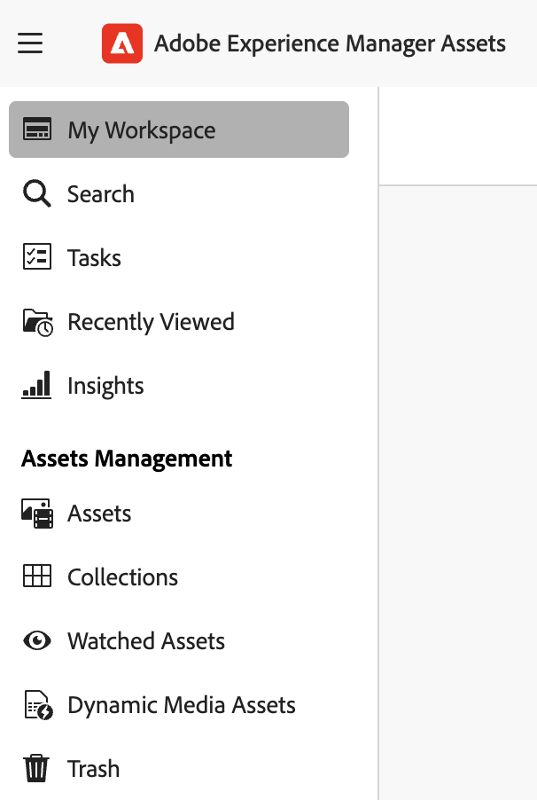

2. Now navigate to **Assets \> WKND Shared \> English \> Activities**

   > You may still be in the **List view** from a previous exercise.  To make your system look like the screenshots, you can return to **Grid View**, use the view switcher (top right of the main panel) 

3. Hover over the *hiking* folder tile, click the **ellipsis**, and select **Pin to Quick Access**.

      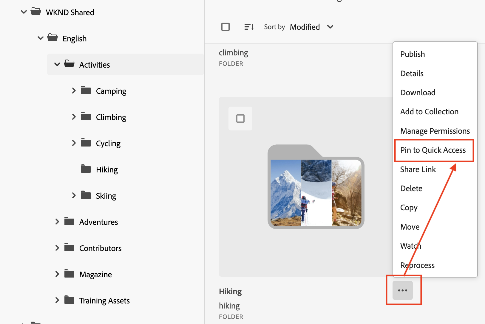

4. A modal dialog appears with multiple options.  Select **For Myself**.

5. In the green confirmation message choose **view** or navigate to **My Workspace** as before. The *hiking* folder now appears as a pinned item in the _Quick Access -> My pinned items_ tab.  Had you chosen to pin for a group or organization in the previous step, the folder would instead show in the _Shared Items_ tab.

      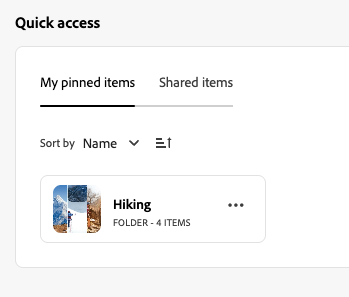

6. Click on the **ellipsis** in your pinned item and click **Open in a new tab**. 

      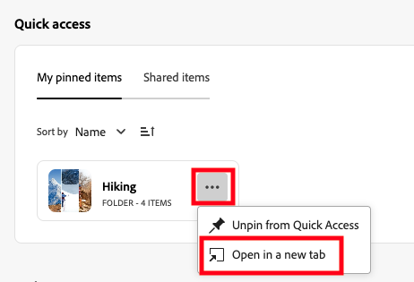

7. The *hiking* folder opens.  Click the **ellipsis** under an image you like and choose **Pin to Quick Access**, in the same way that you added a folder in a previous step.

8. Once again choose to pin **For Myself** and then view the results in your Quick Access area (_My Workspace > Quick Access_).

> *Pinning assets _For Myself_ is similar to the _lightbox_ functionality of the older Admin View assets interface*

### Activity [#]-2: Use Notifications to Track Asset Activity

You can receive notifications whenever assets you care about are updated, published, or have metadata changes.  Here you’ll _watch_ a folder, then trigger a notification later when we publish an updated image.

1. Navigate to the *Training Assets* folder.

2. (Tip:  Read the next step before completing this one!) Select one or more of your fellow students' folders (for example, *RobF*) and in the blue actions bar choose **Watch**.  If you don't see the _Watch_ link, show hidden items by clicking the ellipsis at the end of the bar a shown in the screenshot below.
   
      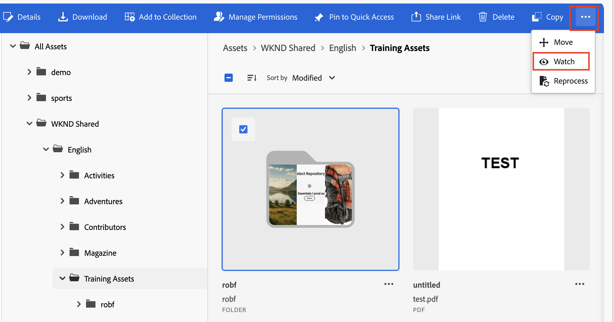
   
3. A green confirmation message will be shown when the _watch_ has been successfully created.  Note that a link to your **Notification Preferences** is shown in the success message.  Click on this.  If the message is no longer visible, you can **unwatch** and **watch** again.

      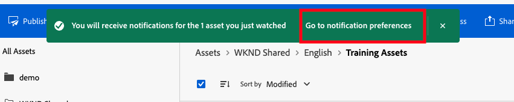

4. In the **Notifications -> Assets** area of the preferences page, ensure that all items are set to **In-app**.  

      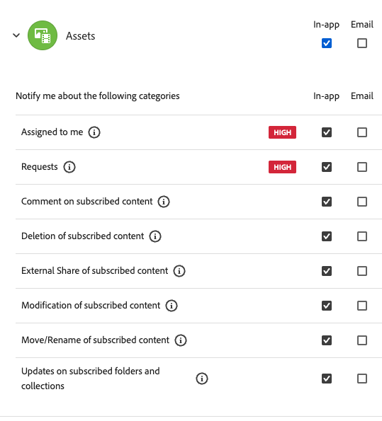

5. In the **Priority** section of the preferences, add the category _Updates on subscribed folders and collections_ if not already present.  Look at the **Alerts** section (below _Priority_) to see that this will result in you receiving popup notifications for your chosen high-priority categories.

      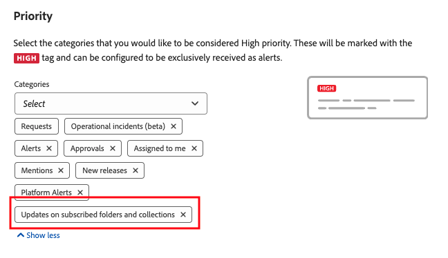

6. Close the tab containing the notifications settings, so returning to the Assets View UI.

7. Click the **Watched Assets** link in the left menu bar.  Select the watched folder to see a list of your watches.

      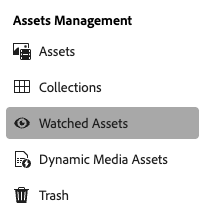

> As we proceed through the exercises you will reveive notification of the activity in your watched items and the bell symbol in the header will be highlighted to alert you to this.

### Activity [#]-3: Insights and Reporting

#### View Asset Insights

Assets View provides automatically generated insights that show how assets are being used over time.
These insights are available at a global level and help authors understand overall asset usage trends.

In this activity, you’ll open the Insights view and review the available charts.

1. From the left navigation pane, click the Insights *graph icon*.

      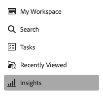

   The Insights page opens, displaying automatically generated charts based on asset usage.

2. Review the available charts.

3. Use the time range dropdowns to explore how asset activity changes over time.

> Insights provide authors with a simple high-level, read-only view of asset usage without running reports or modifying content.

### Activity [#]-4: Collections

#### Create and add assets to a collection

Collections let you group related assets — for example, all images you plan to use in an upcoming campaign — without moving the original files.

1. We'll start by creating an empty Collection.  Click on the Collections icon in the sidebar, then **Create a Collection**.  Give you collection a simple name such as _your-initials-_Collection, select the **private** open and click **Create**.

      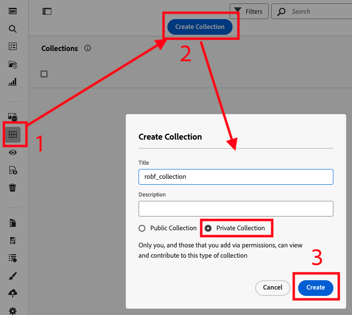

2. From the *WKND Shared > English > Activities* folder, find three images that you like, and for each:

   - Click **Add to Collection** in the blue action menu bar, then choose your Collection and click **Add**.  A confirmation message is shown and the Collection modal closes.

      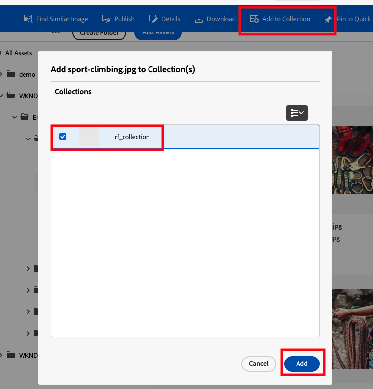
   
   > You can also use an Asset's ellipsis menu to _Add to Collection_.
   
3. Navigate again to **Collections**.You see your chosen images.

>  Note that the images are **not** copies of the originals.  The collection is a kind of virtual folder containing only references to the original images.  For example you can delete a Collection without the contained images being deleted from the system.
> A collection is not as fully featured as a genuine folder.  For example a Collection cannot be used for bulk operations such as applying metadata, nor can a Metadata Form be applied to a Collection.

#### Investigate collection permissions

1. As you create a **private** collection, you can control the access rights to your collection.  To do this view your Collection in the Collections panel, and choose **Manage permissions** from the ellipsis menu.

      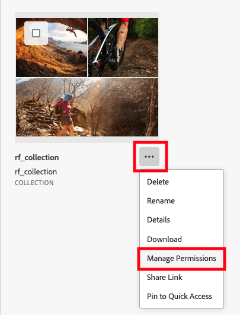

2. Note that you have automatically been added as the Collection owner.

3. We won't apply and test permissions in this course, but if you're working with another student, feel free to experiment with the permissions system by assigning permissions to them.  The next section, sharing, may come in useful for this!

#### Challenge: Being Smart!

In this small challenge we will try out Smart Collections and Smart Tagging.    

1. Create a [Smart Collection](https://experienceleague.adobe.com/en/docs/experience-manager-cloud-service/content/assets/assets-view/manage-collections-assets-view#manage-smart-collection) bnased on one of the sporting/outdoor themes in the **WKND Shared** folder (e.g., camping, cycling, surfing..).  

3. Using a search engine find a suitable test image for this topic on the internet, with a clear subject (so for 'cycling' chose something with a clear bicycle). 

4. Test your collection and [Smart Tagging](https://experienceleague.adobe.com/en/docs/experience-manager-cloud-service/content/assets/manage/smart-tags) by **uploading a screenshot** of the test image in to **your folder** in Training Asset (the screenshot hack will ensure that the test image has no topic-specific metadata or naming).

Has your image been added to your Smart Collection?  Is the metadata-less image now included?

Bonus question: How can you remove images from the Smart Collection? (don't spend more than a couple of minutes on answering this)

### Activity [#]-5: Sharing links

You can share a collection, folder or individual asset as a secure link — useful for review or external collaboration.

1. Choose your original test image and choose **Share link** from the ellipsis menu.

      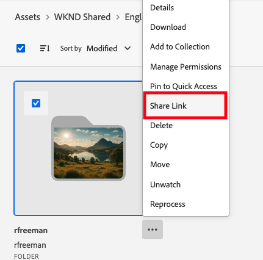

2. Copy the link from the link share dialog, and note that the link has a unique ID.  It is not just a simple path to the entity that you shared, and does have an expiry time which you can set at this point.

3. Open an incognito window, or a different browser in which you are **NOT logged in** with an Adobe account.  

4. Paste the shared link into the address bar.  Notice the link is to an author URL such as: ```https://author-p123456-e123456.adobeaemcloud.com/linkshare.html?sh=_long_unique_id```, and all content on an author instance would normally require authentication.

5. Click return and see that image is visible and can be downloaded by your simulated **unauthenticated user** in the Link Share viewer

      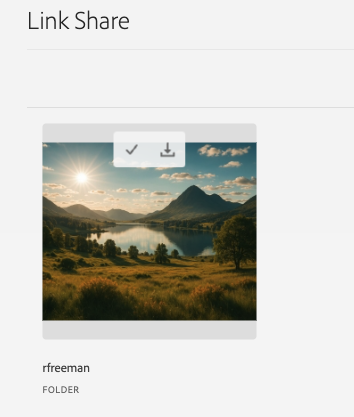

