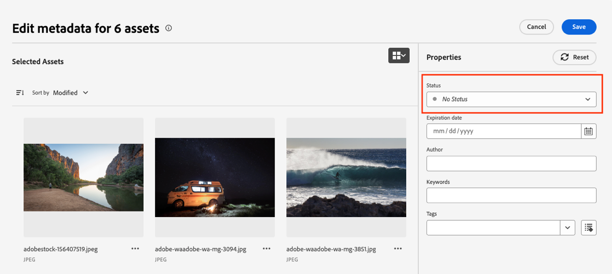
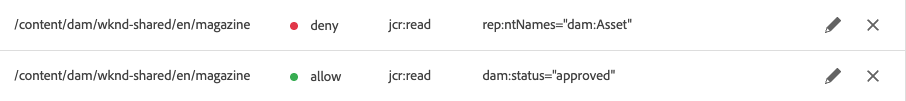
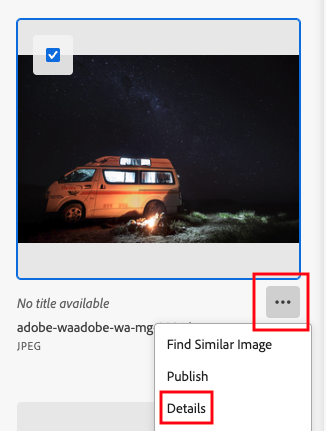
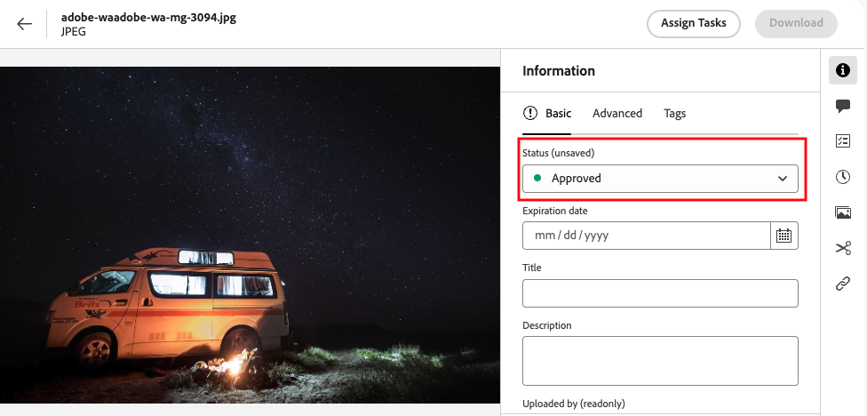
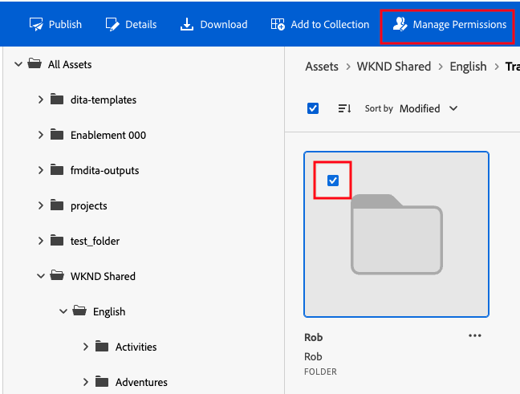
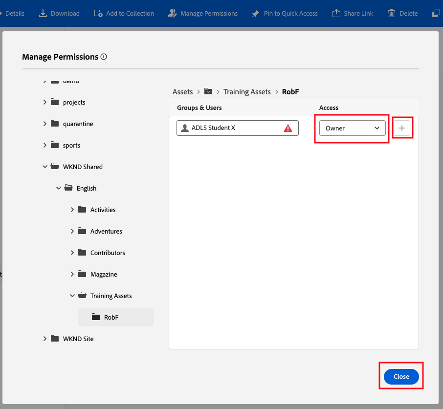
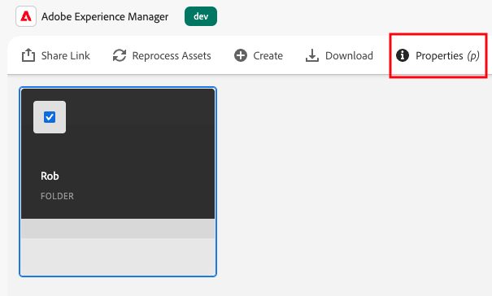
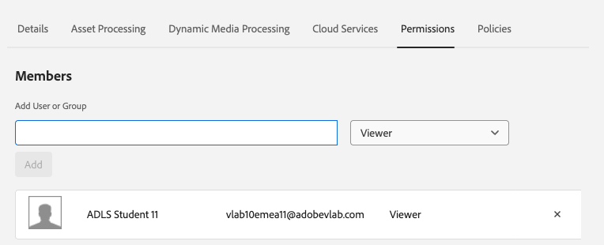
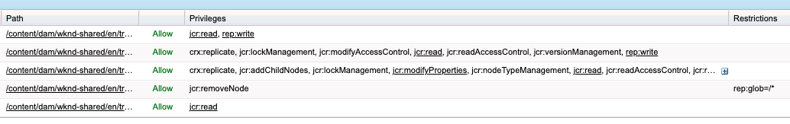

# Module [#]: Access Control

#### Introduction

AEM Assets has the folder permissions feature which provides simplified and granular access control in the AEM DAM.  

The Metadata Driven Permissions feature is new (released in late 2024) and is an important enabler for the adoption of metadata-first asset management.

In this module you will see a demonstration of Metadata Driven Permissions, and configure folder permissions in both Assets View and Admin View. 

#### Objectives

- Understand configuration and use of Metadata Driver Permissions (demonstration)
- Configure folder permissions in Assets View
- Configure folder permissions in Admin View
- Understand the associated complexity and need for governance

#### Module Navigation

<!-- START do not remove -->
<!-- START doctoc -->
<!-- END doctoc -->
<!--{returnToMainTOC}-->
<!-- END do not remove -->

## Demonstration [#].1: Metadata-Driven Permissions (do not do this activity)

Metadata Driven Permissions was released in late 2024 and is an important enabler for the adoption of metadata-first asset management.

In this demonstration you will see a system ACL configuration that allows the metadata property ***dam:status*** to be used for access control (part of the configuration needed must be completed by a developer and we will not look at that).

The use case is that a non-privileged user should only see approved assets. For training purposes, the restrictions will only be applied to a single folder: the *WKND Magazine* folder.

Switch to the Assets View.

Open the ***Magazine \> Western Australia*** folder and **bulk update** all assets, setting the **status to *No Status***.

Open the AEM Admin View Tools \> Security \> Permissions. Search for the *Contributors* group and add two entries, limiting read access in the *Magazine* folder of WKND Shared. First the **deny**, then the **allow**.

**Login** as a user with read-only permissions in the DAM (a member of the *Contributors* group only) and open the Assets View UI.

Navigate through to the ***Magazine \> Western Australia*** folder and notice that **no assets are visible**. This is because the *Magazine* folder has been configured to only show **approved** assets to *Contributors*.

Now switch to a more privileged user (any of student users) and navigate to the same folder.

Click on the ellipsis icon for an image and choose *Details*.

In the *Edit Metadata* dialog, change the **Status to Approved** and click Save.

Switch to the browser with the *Contributor* user session and refresh the *Western Australia* folder page. The image you enabled above should now be visible.

Switch view to show this also working in the Admin View.

In the privileged session reset the Status to *No Status* and remove the ACL entries you created in step 2.

> Health warning: AEM ACLs are complex. Like any ACL mechanism in AEM,
> the Metadata Driven Permissions system should be used sparingly and
> ideally applied at a high level within the folder structure. The
> example shown breaks an AEM ACL best-practice of avoiding deny rules
> at low levels of the repository and would reduce system
> maintainability.

## Activity [#]-2: Folder Permissions Management 

In this activity you will explore folder permissions management features in the Assets and Admin Views.

### Set folder permissions in Assets View

In the Assets View UI navigate to *All Assets \> WKND Shared \> English \> Training Assets*, select ***your folder*** (the folder you created earlier) and then click **Manage Permissions**.

The permissions editor opens, and any user can be added and the dropdown used to set access rights in a user-friendly way, although using AEMs standard permissions system.

Enter your student email address and give yourself **owner permissions** (“Owner”) in the pulldown. Accept the warning.

**Click the plus button** (this is only for exercise purposes as you can of course already edit! We will look at the effect of this in the different UIs shortly).

Click **Close**

### Check and set folder permissions in Admin View

Use the *Switch View* to change to the Admin View UI.

Select your folder again and open the properties.

In the permissions tab is a similar properties feature. Note that there are no permissions listed, i.e., what you just did in the Asset View is **not** visible (although they **are effective in both the Asset View and Admin View!**).

Add yourself here as an **editor** by typing in your email address and clicking **Add**.

Click **Save and Close.**

### Check for changes in Assets View

Change to the Assets View by using the *Switch View* toggle again, select your folder, and open the **Manage Permissions** dialog again using the link in the blue toolbar.

Note that the *editor* permissions that you just gave yourself in the Admin UI are not listed (although they **are effective in both the Asset View and Admin View!**).

### Explanation 

**Both systems have added ACL entries to your folder**, although without testing we can’t be sure of the effect. AEM has sophisticated ACL processing functionality that will merge the ACLs from your changes in the Asset View UI, with those from your changes in the Admin View UI, to set the effective permissions on your folder.

The screenshot below is of the raw permissions that resulted, viewed in the CRX DE developers’ interface. A set of complex permissions configurations have been created and even an experienced AEM developer would struggle to work out what has created these, how they interact and what the outcome would be!

 

Therefore, if this UI-based permissions functionality is needed it should only be used in **either** the Assets View UI **OR** the Admin View UI for a given repository area. If this governance is not in place complex and conflicting ACLs could result.

Such a situation is likely to lead to bugs and therefore increased maintenance cost.

Always apply strict governance to ACL configuration in AEM projects.
