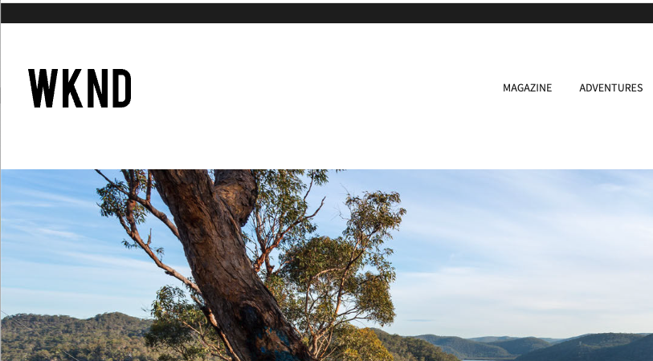
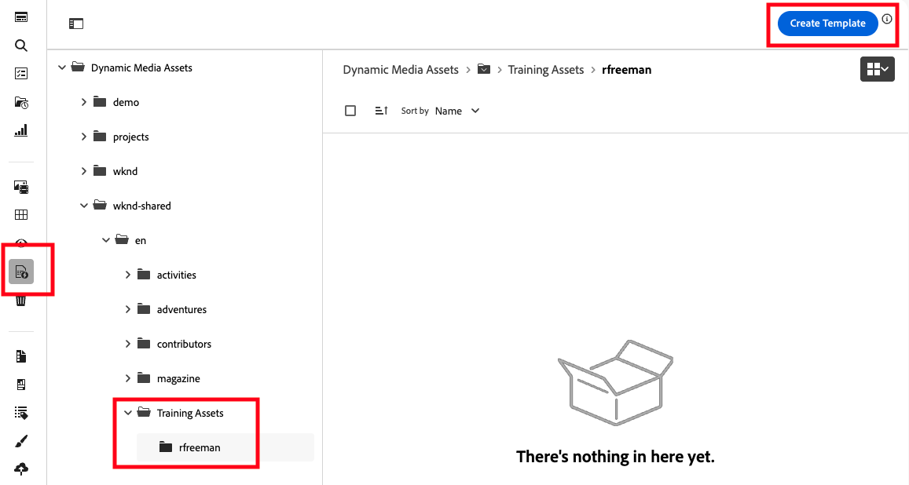
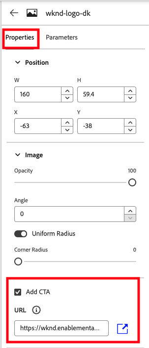
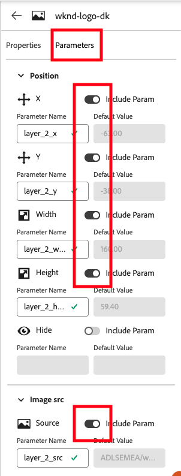
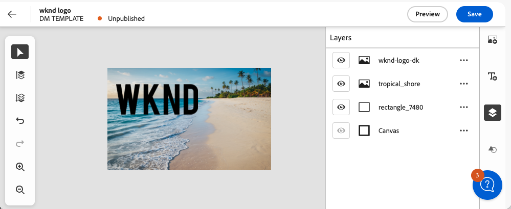
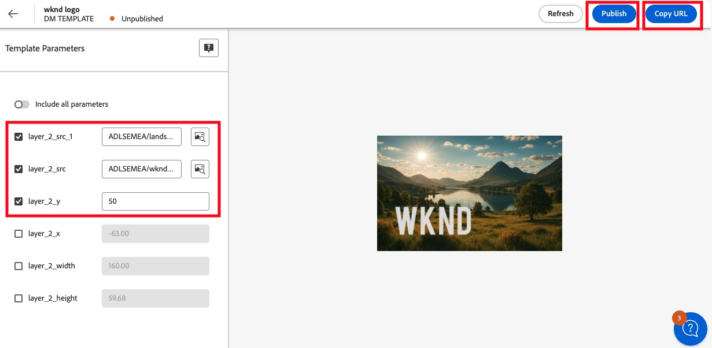

# Module [#]: Dynamic Media Templates

#### Introduction

In this activity you will learn to use the Dynamic Media Template Editor.   

The scenario for this is:

- the [WKND website](https://wknd.enablementadobe.com/us/en.html) team have identified that their logo and website header combination does not fit the brand well, and should be updated to present a more adventurous, exciting or exotic feel to the website.

 

- The logo area should change weekly giving the website a fresh look for returning visitors.
- To make changes in logo position, font, colour and background images would need either ongoing work by the creative team, and/or development work to make changes to the page HTML and styling.
- The team have decided to try Dynamic Media Templates so that the website authors can make changes to the logo area dynamically using URL parameters that they will define in Dynamic Media templates, and configure in the Experience Manager header component. 
- In the activity we will prepare a proof-of-concept logo and background image for the team.  
- The logo will only be used on full screen views.  The logo size is 320 x 200px.

#### Module Navigation

<!-- START do not remove -->
<!-- START doctoc -->
<!-- END doctoc -->
<!--{returnToMainTOC}-->
<!-- END do not remove -->

### Activity [#]-1: Create a Dynamic Media Template

#### Create a Dynamic Media Template

1. From the left navigation, select **Dynamic Media Assets**.

2. Navigate to your training folder created earlier in the course, then open the **dynamic_media** subfolder.

   > Note! you do not see your images as only Dynamic Media assets are visible in this view.

3. Click **Create Template** (top right). A modal dialog opens.  

      
   
4. Enter a template name using your initials, for example _rf_template_, and set the canvas size to 320 x 200.  The template editor opens.

5. Take a moment to **explore the user interface**, particularly the buttons in the right menu, for **accessing assets, adding text, managing layers and adding shapes**.  You can undo anything you create with the _undo_ icon in the left menu or Ctrl+Z (Windows), Cmd+Z (Mac). 

> Note that the search will only show assets that have been processed for use with Dynamic Media.  You may not see all assets on the system.  

#### Recreate the existing basic logo

First recreate the existing logo: a simple black WKND SVG roughly in the middle of the canvas.

1. Use the **shapes** menu to add a white rectangle, then adjust it to cover the entire canvas.  

2. In the **asset picker**, search for _wknd-logo_ and drag **wknd-logo-dk.svg** on to the canvas.

3. Authors will want to **move, resize and change the source image**.  Additionally the image should **link to the WKND home page** (```https://wknd.enablementadobe.com/us/en.html```).  You can meet these requirements by exposing the appropriate properties as **parameters** as shown below (layer properties / parameters tabs)

      

      

#### Select the background image

1. Upload one of the images from the activity-files/dm_templates folder in to your folder in _Training Assets_ (or choose a background image of your own).

2. Back in the Template editor, use the asset browser from the icon in the right column to find and drag your uploaded image on to the canvas.

3. Resize the image to cover the canvas.

4. In the left menu of the editor, reorder your layers so that the WKND logo is at the front.

5. Make the source of the image a parameter so that the authors can dynamically change the image.

At this stage you should have a usable banner, similar to the one shown in the screenshot below (depending on which image you chose):

   

#### Preview the image and test parameters

1. Save the template then preview (both buttons on the top right).

2. In the preview mode you can see and adjust the properties that are exposed as parameters.  Try swapping the logo for the light version and moving it.

3. Change some parameters, then click **publish**, and  **copy URL**.

   

4. Examine the URL.  Notice that the parameters you chose are included in the URL.  Removing or changing them will allow you (and the authors) to dynamically change the image.

5. Paste the URL into a browser tab and request the image.  

> If you get an error, it is likely that one or more of the constituent assets have not been published.  Check and publish as necessary.

